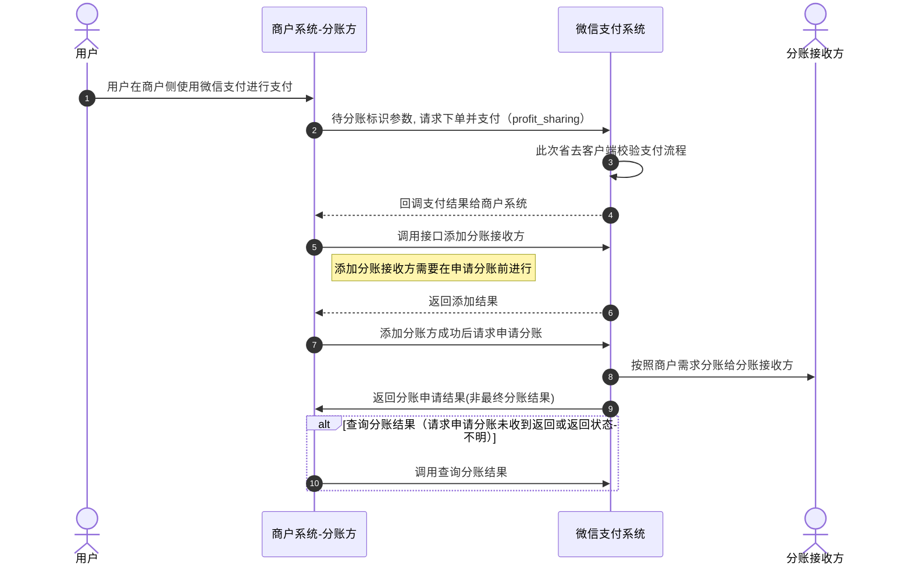

>更新时间：2026.06.09

## 1. 接口规则

为了在保证支付安全的前提下，带给商户简单、一致且易用的开发体验，我们推出了全新的微信支付APIv3接口。该版本API的具体规则请参考[APIv3接口规则](https://pay.weixin.qq.com/doc/v3/merchant/4012081606.md)。

## 2. 开发准备

### 2.1. 搭建和配置开发环境

开发者应当依据自身的编程语言来构建并配置相应的开发环境。

## 3. 快速接入

### 3.1. 业务流程图

重点步骤说明：

步骤4：商户发起添加分账接收方请求（[添加分账接收方API](https://pay.weixin.qq.com/doc/v3/merchant/4012528995.md))，商户的分账接收方数量上限为2万。若已达到上限，可删除部分未使用的接收方后重新添加。

步骤6：在基础支付中上传参数 `profit_sharing`，请求支付。支付完成后，调用[请求分账接口](https://pay.weixin.qq.com/doc/v3/merchant/4012524936.md)；

步骤7：请求分账接口采用异步处理模式，即在接收到商户请求后，会先受理请求（受理请求返回的结果非最终分账结果）再异步处理，最终的分账结果需要通过[查询分账结果接口](https://pay.weixin.qq.com/doc/v3/merchant/4012525210.md)获取；

步骤8：调用[查询分账结果接口](https://pay.weixin.qq.com/doc/v3/merchant/4012525210.md)，根据 `receivers.result` 判断每个接收方的分账结果，如返回 `CLOSED：已关闭`，可根据返回的 `receivers.fail_reason` 分账失败原因参考[分账失败处理指引](https://pay.weixin.qq.com/doc/v3/merchant/4015505684.md)进行处理。

| 参数名 | 变量 | 类型\[长度限制\] | 必填 | 描述 |
| --- | --- | --- | --- | --- |
| 是否需要分账 | profit\_sharing | boolean | 否 | 是否指定分账，枚举值 true：是 false：否 |

说明： 实现分账只是在普通支付下单接口中新增了一个分账参数profit\_sharing，其他与普通支付方式完全相同。目前支持付款码支付、JSAPI支付、Native支付、App支付、小程序支付、H5支付、委托代扣。