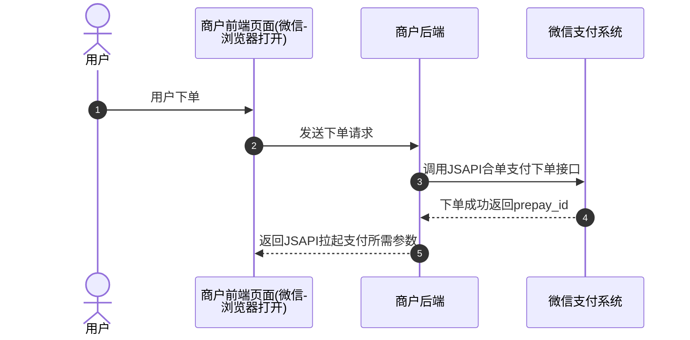
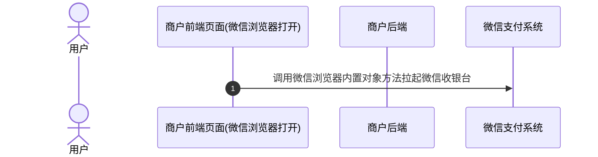
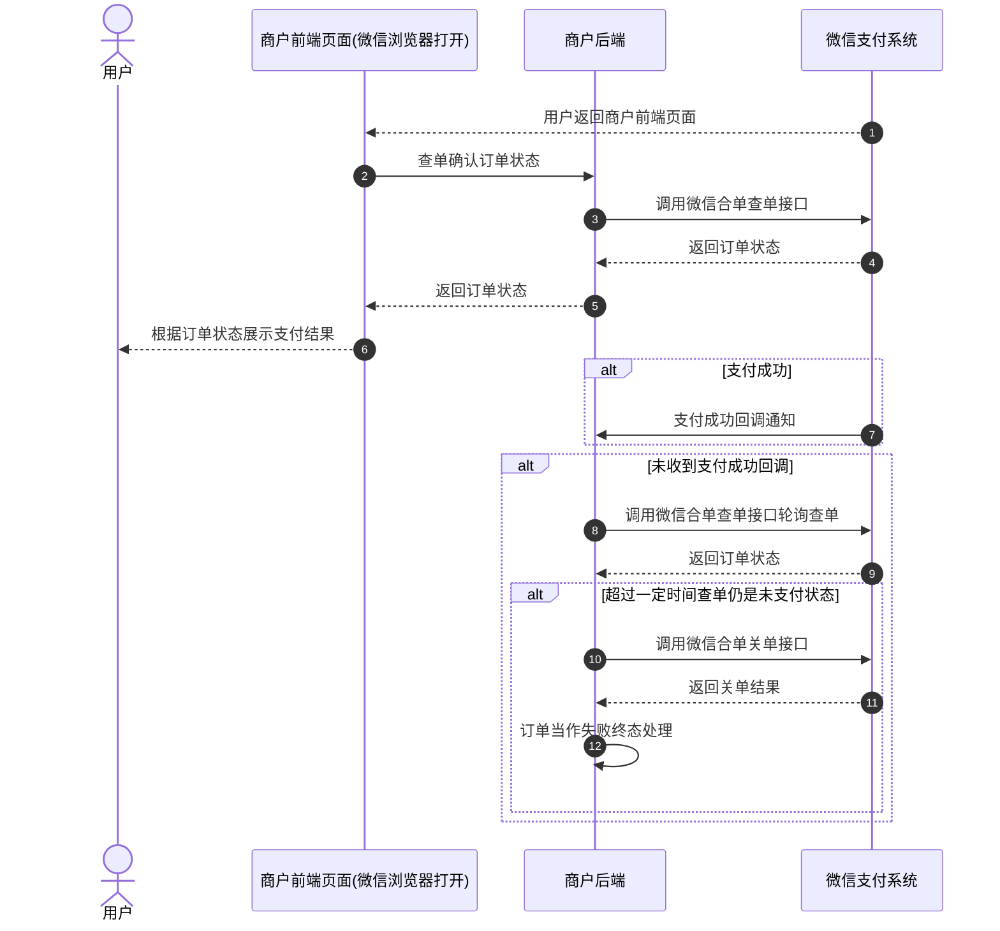
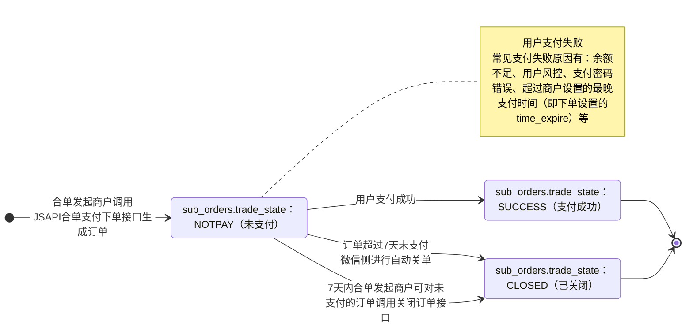

>更新时间：2026.06.09

## 1、整体业务开发流程概览

- 商户通过调用[JSAPI合单下单](https://pay.weixin.qq.com/doc/v3/merchant/4012556926.md)接口获取预支付ID `prepay_id`，商户前端页面再通过调用[WeixinJSBridge](https://pay.weixin.qq.com/doc/v3/merchant/4012266069.md)对象方法调起微信支付收银台。

- 当用户取消支付或支付成功后点击"完成"按钮，会返回拉起支付前页面，同时商户前端页面将收到回调，此时商户后端需调用[查询合单订单API](https://pay.weixin.qq.com/doc/v3/merchant/4013421222.md)接口确认订单状态，并根据订单状态进行相应的业务逻辑处理（在商户页面向用户展示查询到的订单支付状态、在商户内部系统更新订单状态等），如果订单支付成功，微信支付系统还会发送[合单订单支付成功回调通知](https://pay.weixin.qq.com/doc/v3/merchant/4013421231.md)给商户。具体的支付回调和查单的实现方案，商户可以参考[支付回调和查单实现指引](https://pay.weixin.qq.com/doc/v3/merchant/4012075249.md)。

- 最后商户可通过[下载交易账单](https://pay.weixin.qq.com/doc/v3/merchant/4013421277.md)进行对账。需要退款的订单，也可调用[退款接口](https://pay.weixin.qq.com/doc/v3/merchant/4013421249.md)完成退款。

## 2、详细步骤说明

### 2.1、商户下单

商户通过调用[JSAPI合单下单API](https://pay.weixin.qq.com/doc/v3/merchant/4012556926.md)接口生成订单并获取预支付ID `prepay_id`。

下单接口关键参数说明：

`combine_mchid`：合单发起方的商户号，需先申请发起合单支付权限，详细参考：[开发接入准备-步骤3](https://pay.weixin.qq.com/doc/v3/merchant/4015764634.md)。

`sub_order.mchid`：子单参与方的商户号，需先申请接收合单支付权限，详细参考：[开发接入准备-步骤3](https://pay.weixin.qq.com/doc/v3/merchant/4015764634.md)。

`combine_appid`：公众账号ID，合单发起方商户号 `combine_mchid` 和子单参与方商户号 `sub_order.mchid` 都需要绑定同一个 `combine_appid`，详细参考：[开发接入准备-步骤4和5](https://pay.weixin.qq.com/doc/v3/merchant/4015764634.md)。

`time_expire`：支付结束时间。若传递该参数，则用户只能在订单设置的支付结束时间 `time_expire` 之前进行支付，超过支付结束时间后，用户支付将收到："订单已超过商户设置的最晚支付成功时间，请重新发起支付"的提示，商户需对订单进行关单处理。若不传该参数，默认订单支付有效期为7天，用户可在7天内进行支付，超出7天，订单将被关闭。

`openid`：用户在商户下单的appid下唯一标识，获取方式详见[参数说明](https://pay.weixin.qq.com/doc/v3/merchant/4012068676.md)。

`prepay_id`：预支付交易会话标识。调起支付时需要使用的参数， `prepay_id` 有效期为2小时，超过2小时，商户需要使用原下单参数重新请求下单接口，获取新的 `prepay_id`。

`profit_sharing`：订单分账标识，如果订单在支付成功后需要进行分账，必须传参数值为 `true`。如果无需分账，可以不传该参数，或传 `false`。

### 2.2、商户调起支付

商户调起支付前，请确保合单发起方商户（combine\_mchid）已在[商户平台](https://pay.weixin.qq.com/)配置好JSAPI支付授权目录（只有[配置了JSAPI支付授权目录](https://pay.weixin.qq.com/doc/v3/merchant/4013287088.md)的网页才能调起支付），然后通过调用微信浏览器内置对象方法来调起微信收银台，具体请参考[JSAPI调起支付](https://pay.weixin.qq.com/doc/v3/merchant/4012266069.md)

### 2.3、用户支付

用户在微信收银台完成支付/取消支付，返回商户前端页面后，微信浏览器内置对象方法(WeixinJSBridge)会收到回调，此时商户需要调[查询合单订单API](https://pay.weixin.qq.com/doc/v3/merchant/4013421222.md)接口确认订单状态，并根据订单状态展示支付结果。

同时，如果用户支付成功，微信支付系统会向商户发送[合单订单支付成功回调通知](https://pay.weixin.qq.com/doc/v3/merchant/4013421231.md)，未收到回调时，商户也可调用[查询合单订单API](https://pay.weixin.qq.com/doc/v3/merchant/4013421222.md)接口确认订单状态。具体实现方案商户可以参考[支付回调和查单实现指引](https://pay.weixin.qq.com/doc/v3/merchant/4012075249.md)。

若商户需要限制用户支付的时间，有以下两种方式：

1、下单时通过 `time_expire` 参数，设置订单的支付结束时间，超过设置的结束时间后，商户进行关单处理。

2、商户在自己的系统内进行倒计时，超过有效期，进行关单处理。

若因特殊原因需在用户可支付时间范围内关闭订单，商户可通过调用[查询合单订单API](https://pay.weixin.qq.com/doc/v3/merchant/4013421222.md)接口确认订单状态（请勿使用非合单支付的查单接口查询合单订单），若订单仍是未支付状态，商户可以调用[关闭合单订单API](https://pay.weixin.qq.com/doc/v3/merchant/4013421225.md)接口关单（关闭整个合单订单，而非关闭单个子单），关单后可以将订单当作失败终态处理。

### 2.4、商户对账

合单支付的订单账单是以子单为维度，每笔子单都会记录在各个子单商户账单内，需要各个子单商户自己进行下载。详细参考：[账单产品介绍](https://pay.weixin.qq.com/doc/v3/merchant/4013071215.md)

### 2.5、订单退款

合单支付的订单退款，无法通过合单商户订单号 `combine_out_trade_no` 退款，只能根据单个子单进行退款。详细参考：[退款产品介绍](https://pay.weixin.qq.com/doc/v3/merchant/4013071001.md)

## 3、合单支付订单状态流转图

1、商户调用[JSAPI合单支付下单](https://pay.weixin.qq.com/doc/v3/merchant/4012556926.md)接口下单成功后，商户可以调用[查询合单订单](https://pay.weixin.qq.com/doc/v3/merchant/4013421222.md)接口来确认订单状态，详情请参考[支付回调和查单实现指引](https://pay.weixin.qq.com/doc/v3/merchant/4012075249.md)。

2、当订单状态处于未支付(sub\_orders.trade\_state：NOTPAY)时，用户可对订单进行支付，若用户支付失败，订单状态不变。

3、7天内商户可对无需继续支付的订单（例如用户超过商户系统内部规定的支付时间，或超过商户下单设置的最晚支付时间（time\_expire）的订单）调用[关闭合单订单接口](https://pay.weixin.qq.com/doc/v3/merchant/4013421225.md)，使订单关闭，或超过7天后由微信侧自动关单。关单后，订单状态会从未支付(sub\_orders.trade\_state：NOTPAY)流转为已关闭(sub\_orders.trade\_state：CLOSED)。

4、当用户成功支付订单时，订单状态会从未支付(sub\_orders.trade\_state：NOTPAY)流转为支付成功(sub\_orders.trade\_state：SUCCESS)。

5、当订单状态为支付成功(sub\_orders.trade\_state：SUCCESS)时，如果用户需要退款，商户可调用[申请退款接口](https://pay.weixin.qq.com/doc/v3/merchant/4013421249.md)(仅支持支付成功后1年内的订单)，退款申请成功后，退款状态可通过[查询退款单接口](https://pay.weixin.qq.com/doc/v3/merchant/4013421261.md)进行确认。

6、以下两个状态为终态

- sub\_orders.trade\_state：CLOSED

- sub\_orders.trade\_state：SUCCESS