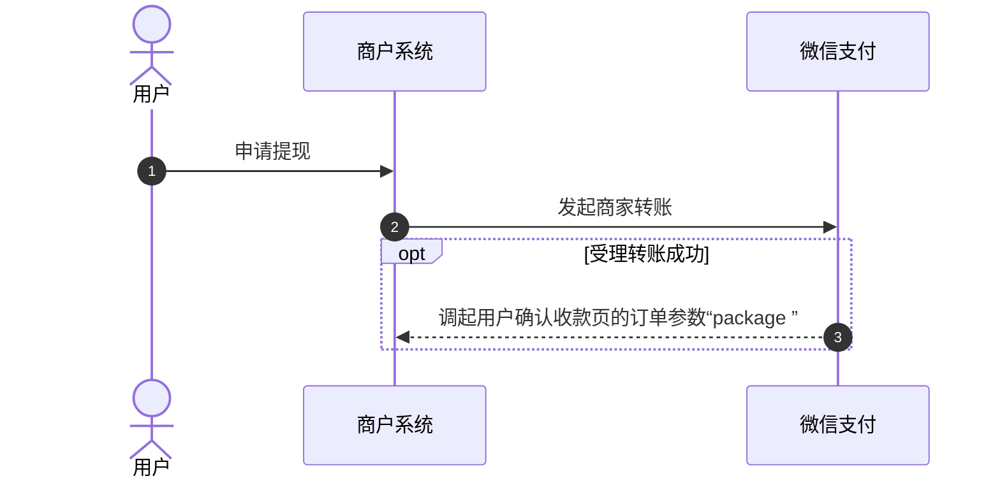
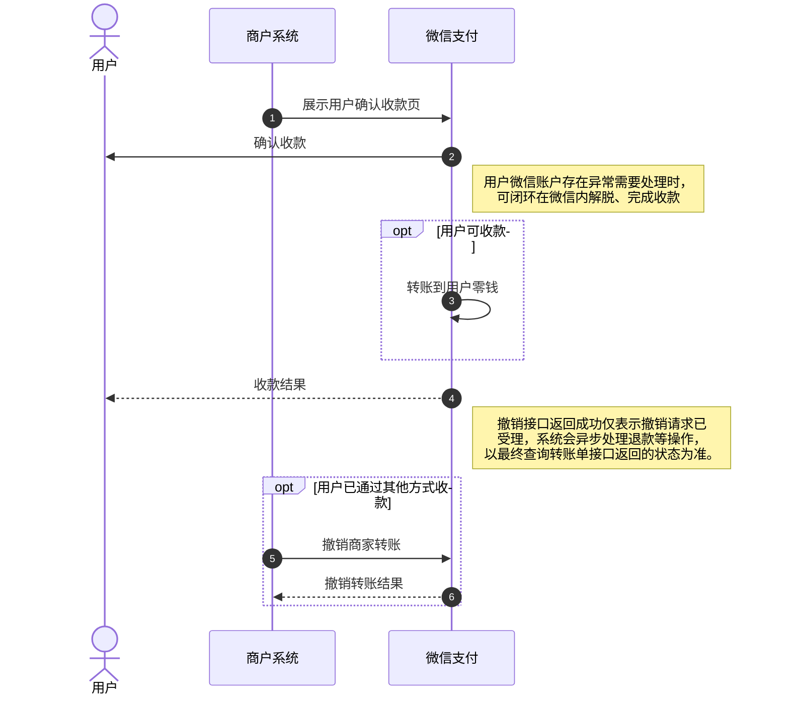
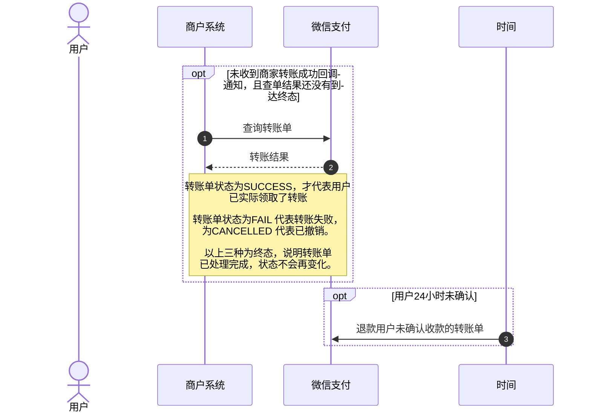
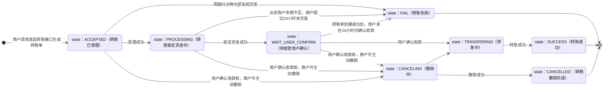
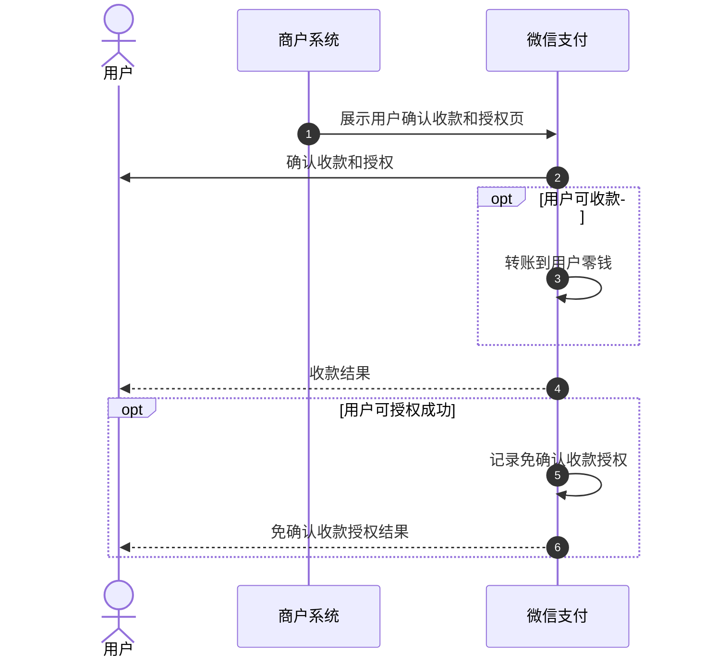
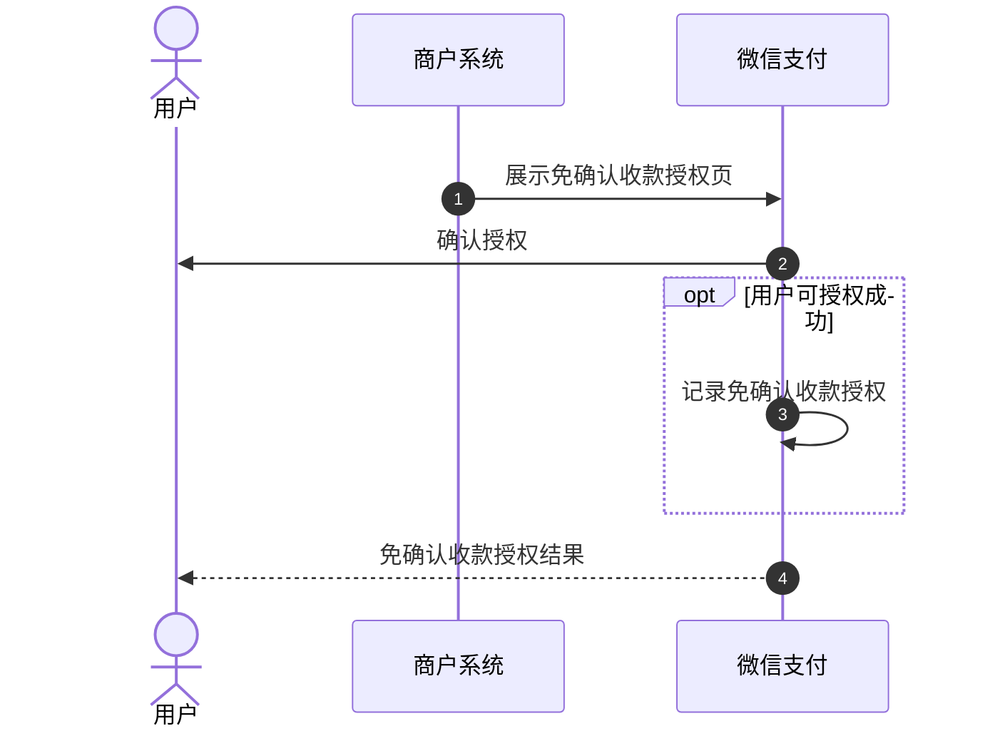
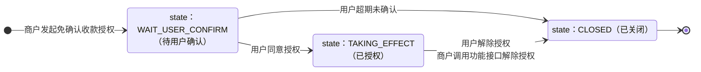
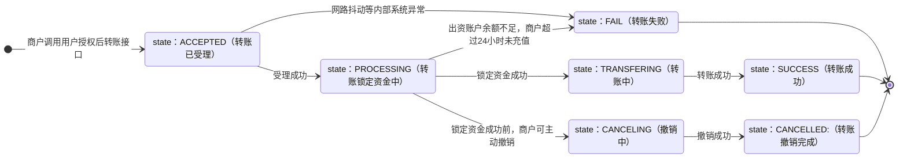

>更新时间：2026.06.23

## 1、开发前配置

开发前，开发者需要完成如下两个步骤：配置开发参数和配置产品功能。

### 1.1、设置安全联系人

微信支付日常安全监测发现技术异常时，会向安全联系人和超级管理员发送风险提醒。请商户超级管理员尽快设置技术同事为安全联系人，确保能及时接收异常信息评估业务风险，详见[安全联系人设置指引](https://pay.weixin.qq.com/doc/v3/merchant/4012076563.md)。

### 1.2、熟悉微信支付接口规则

正式进入开发前，开发者需要先阅读[基本规则](https://pay.weixin.qq.com/doc/v3/merchant/4012081709.md)、[签名和验签规则](https://pay.weixin.qq.com/doc/v3/merchant/4012365342.md)了解调用微信支付接口的基本规则和签名规则。

### 1.3、准备开发参数

在发起接口请求时，开发者需传入必要参数，如商户号、appid、密钥及证书序列号等，获取方式详见：[普通商户模式开发必要参数说明](https://pay.weixin.qq.com/doc/v3/merchant/4013070756.md)。

### 1.4、配置产品功能

在使用商家转账时，必须设置请求来源IP 。仅设定IP可调用商家转账API，具体可详见：[设置接口安全IP](https://pay.weixin.qq.com/doc/v3/merchant/4013751010.md)

注意

当用户通过商户提供的入口申请提现后，商户系统可选择以下任意一种收款模式发起转账给用户

- 用户确认收款模式

- 用户授权免确认模式

## 2、 详细开发指引（用户确认收款模式）

### 2.1、整体业务开发流程概览

- 商户系统同步调用[发起转账](https://pay.weixin.qq.com/doc/v3/merchant/4012716434.md)接口申请转账，商户再根据返回参数拉起用户确认收款页让用户确认收款。

- 用户确认收款前，如需取消转账，商户可调用[撤销转账](https://pay.weixin.qq.com/doc/v3/merchant/4012716458.md)接口撤销转账。

- 如需要电子回单，可通过申请电子回单API接口和查询电子回单API接口获取

### 2.2、详细开发步骤说明

#### 2.2.1、商户发起转账申请

当用户申请提现时，商户需调用[发起转账API](https://pay.weixin.qq.com/doc/v3/merchant/4012716434.md)接口发起申请转账。在接口参数中，商户需要通过transfer\_scene\_report\_infos字段上传转账场景报备背景信息，不同的场景有不同的传值要求，详见：

- [现金营销](https://pay.weixin.qq.com/doc/v3/merchant/4013774588.md)

- [企业赔付](https://pay.weixin.qq.com/doc/v3/merchant/4013774589.md)

- [佣金报酬](https://pay.weixin.qq.com/doc/v3/merchant/4013774590.md)

- [采购货款](https://pay.weixin.qq.com/doc/v3/merchant/4013774591.md)

- [二手回收](https://pay.weixin.qq.com/doc/v3/merchant/4013774592.md)

- [公益补助](https://pay.weixin.qq.com/doc/v3/merchant/4013774593.md)

- [行政补贴](https://pay.weixin.qq.com/doc/v3/merchant/4013774594.md)

- [保险理赔](https://pay.weixin.qq.com/doc/v3/merchant/4013774595.md)

注意：

- 当返回商户订单状态为ACCEPTED时，需登录商户平台查看确认运营账户资金是否足够（商户平台- 交易中心- 资金流水），并一定要使用原商户单号及原参数重试，否则可能造成重复转账等资金风险

- 发起转账的appid参数，请按照实际调起用户确认收款APP/小程序/公众号的appid进行传参。

- 当返回错误码为“SYSTEM\_ERROR”时，请不要更换商户单号，一定要使用原商户单号及原参数重试，否则可能造成重复转账等资金风险。

- 接口返回的HTTP状态码不为200时，请商户务必不要立即更换商户订单号重试。可根据错误码列表中的描述和接口返回的信息进行处理，并在查询原订单结果明确为失败时，再更换商户订单号进行重试。否则会有重复转账的资金风险。

- 如果发起转账接口遇到新的错误码，请务必不要换单重试，需通过[商户单号查询转账单API](https://pay.weixin.qq.com/doc/v3/merchant/4012716437.md)接口或[微信单号查询转账单API](https://pay.weixin.qq.com/doc/v3/merchant/4012716457.md)接口查询订单结果，当查询原订单结果明确为失败时，再更换商户订单号进行重试。否则会有重复转账的资金风险。

#### 2.2.2、商户调起请求用户确认收款

商户调用[发起转账API](https://pay.weixin.qq.com/doc/v3/merchant/4012716434.md)接口创建转账单成功（订单状态为WAIT\_USER\_CONFIRM），会获取到用于拉起确认收款页面的关键参数"package\_info"，商户需根据自己使用商家转账的载体选择对应API接口拉起用户确认收款页，移动应用类型使用[APP调起用户确认收款](https://pay.weixin.qq.com/doc/v3/merchant/4012719576.md)，公众号及小程序类型使用[JSAPI调起用户确认收款](https://pay.weixin.qq.com/doc/v3/merchant/4012716430.md)

下面介绍在转账过程中的异常处理情况：

- 在用户确认收款之前，若发现用户已通过其他方式收款，可通过调用撤销转账API接口撤销转账。撤销接口返回成功仅表示撤销请求已受理，系统会异步处理退款等操作，需以最终查询转账单返回的状态为准

- 当前商户单号单据状态已到达终态时，不可再用该单号请求用户确认收款；如需再次转账，需更换单号。

调起用户确认收款需要注意的参数：

package：商家转账付款单跳转收款页package信息，对应的是[发起转账API](https://pay.weixin.qq.com/doc/v3/merchant/4012716434.md)接口应答参数中的package\_info

#### 2.2.3、用户确认收款

用户完成确认收款后，微信支付会向商户发送[商家转账回调通知](https://pay.weixin.qq.com/doc/v3/merchant/4012712115.md)，告知转账结果。为确保在未收到回调通知的情况下仍能及时、准确地获取转账单据状态，商户必须接入[商户单号查询转账单API](https://pay.weixin.qq.com/doc/v3/merchant/4012716437.md)接口或[微信单号查询转账单API](https://pay.weixin.qq.com/doc/v3/merchant/4012716457.md)接口兜底进行结果查询

注意：

- 使用[商户单号查询转账单API](https://pay.weixin.qq.com/doc/v3/merchant/4012716437.md)或[微信单号查询转账单API](https://pay.weixin.qq.com/doc/v3/merchant/4012716457.md)接口只支持查询最近30天内的商家转账订单，超过30天需通过资金账单对账确认。获取资金账单的方式可参考附录中的[获取账单和电子回单](https://pay.weixin.qq.com/doc/v3/merchant/4013748430.md)

- 在资金账单中，微信支付业务单号和资金流水单号对应的是transfer\_bill\_no微信转账单号，业务凭证号对应的是out\_bill\_no商户单号，资金账单中的收支类型仅有支出时可认为是转账成功。

#### 2.2.4、申请电子回单(按需使用)

- 转账成功后，商户可通过[商户单号申请电子回单API](https://pay.weixin.qq.com/doc/v3/merchant/4012716452.md)接口或[微信单号申请电子回单API](https://pay.weixin.qq.com/doc/v3/merchant/4012716456.md)接口申请电子回单，申请成功后需通过[商户单号查询电子回单API](https://pay.weixin.qq.com/doc/v3/merchant/4012716436.md)接口或[微信单号查询电子回单API](https://pay.weixin.qq.com/doc/v3/merchant/4012716455.md)接口获取电子回单申请进度，当申请单状态为FINISHED时，接口会返回回单文件的下载地址和摘要信息

- 申请电子回单需同时满足以下条件：

  - 转账成功的单据

  - 传入了姓名的转账单据

  - 六个月内的转账单据

### 2.3、订单状态流转图

1、从转账单据创建成功后开始计算，如果用户24h内未确认收款，系统会自动关单并退款至商户资金。系统关单时间可能超过24小时，商户需通过查询商家转账单接口核实转账单是否已成功关闭，若该笔转账单还未关闭，请勿换单发起转账，商户也可通过[撤销转账API](https://pay.weixin.qq.com/doc/v3/merchant/4012716458.md)接口主动撤销该订单。

2、以下三个状态为终态

- SUCCESS: 转账成功

- FAIL: 转账失败

- CANCELLED: 转账撤销完成

## 3、详细开发指引（用户授权免确认模式）

### 3.1、整体业务开发流程概览

- 商户发起免确认收款授权申请，可选择以下任意一种：

  - 方式一：发起转账并获取授权

    -  商户系统同步调用 [发起转账并完成免确认收款授权](https://pay.weixin.qq.com/doc/v3/merchant/4014399293.md)，在请求中指定免确认收款授权信息发起转账，并根据返回参数拉起用户确认收款页让用户确认收款，并获取用户授权。
  - 方式二： 直接申请授权

    - 商户系统同步调用[发起免确认收款授权](https://pay.weixin.qq.com/doc/v3/merchant/4015901167.md)在请求中指定免确认收款授权信息，并根据返回参数拉起免确认收款授权页面让用户确认，并获取用户授权。
- 用户完成授权后，商户可通过[免确认收款授权结果通知](https://pay.weixin.qq.com/doc/v3/merchant/4014512908.md) 或者调用[商户单号查询授权结果](https://pay.weixin.qq.com/doc/v3/merchant/4014399423.md)查询结果。

- 用户授权成功后，商户可调用[用户授权后转账](https://pay.weixin.qq.com/doc/v3/merchant/4014399371.md) 直接向用户发起转账，无需用户逐笔确认收款。

### 3.2、详细开发步骤说明

#### 3.2.1、商户发起免确认收款授权申请

方式一：发起转账并获取授权

商户系统同步调用[发起转账并完成免确认收款授权](https://pay.weixin.qq.com/doc/v3/merchant/4014399293.md)，在请求中指定免确认收款授权信息发起转账，并根据返回参数拉起用户确认收款页让用户确认收款，并获取用户授权。

方式二：直接申请授权

商户系统也可调用[发起免确认收款授权](https://pay.weixin.qq.com/doc/v3/merchant/4015901167.md)直接申请授权，并根据返回参数使用[JSAPI调起免确认收款授权](https://pay.weixin.qq.com/doc/v3/merchant/4015930512.md)来获取用户授权

#### 3.2.3、用户确认授权

用户完成授权后，商户可通过[免确认收款授权结果通知](https://pay.weixin.qq.com/doc/v3/merchant/4014512908.md)或者调用[商户单号查询授权结果](https://pay.weixin.qq.com/doc/v3/merchant/4014399423.md)获得授权结果

#### 3.2.4、商户发起授权后转账

用户授权通过后，商户可调用[用户授权后转账](https://pay.weixin.qq.com/doc/v3/merchant/4014399371.md)直接向用户发起转账，无需用户逐笔确认收款。

注意

用户授权通过后，可以通过微信支付入账消息的收款设置操作关闭授权，商户也可调用[解除免确认收款授权](https://pay.weixin.qq.com/doc/v3/merchant/4015653811.md)帮助用户发起解除。

### 3.3、用户免确认授权状态流转图

1、商户调用该接口申请免确认收款授权，用户需在申请的有效期内完成授权（有效期为24小时），过期未完成需更换授权单号重新发起

- 用户未确认的授权记录仅保留30天，超期后原商户授权单号可被再次使用，以重新发起申请

2、以下1个状态为终态

- `CLOSED`: 用户或商户系统关闭，无法转账至该授权对应的用户

### 3.4、订单状态流转图

