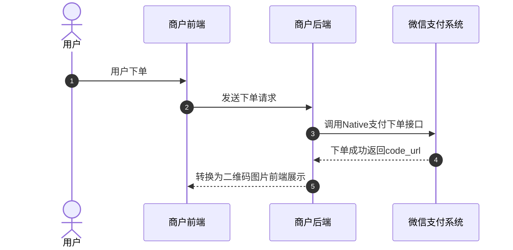
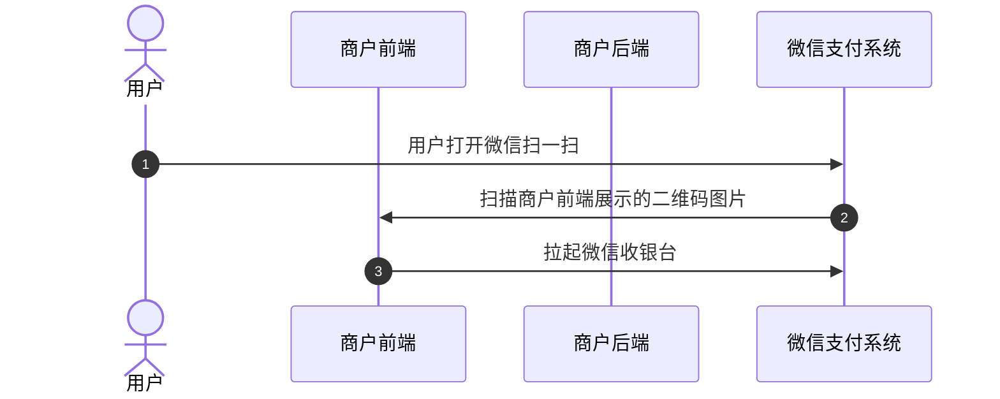
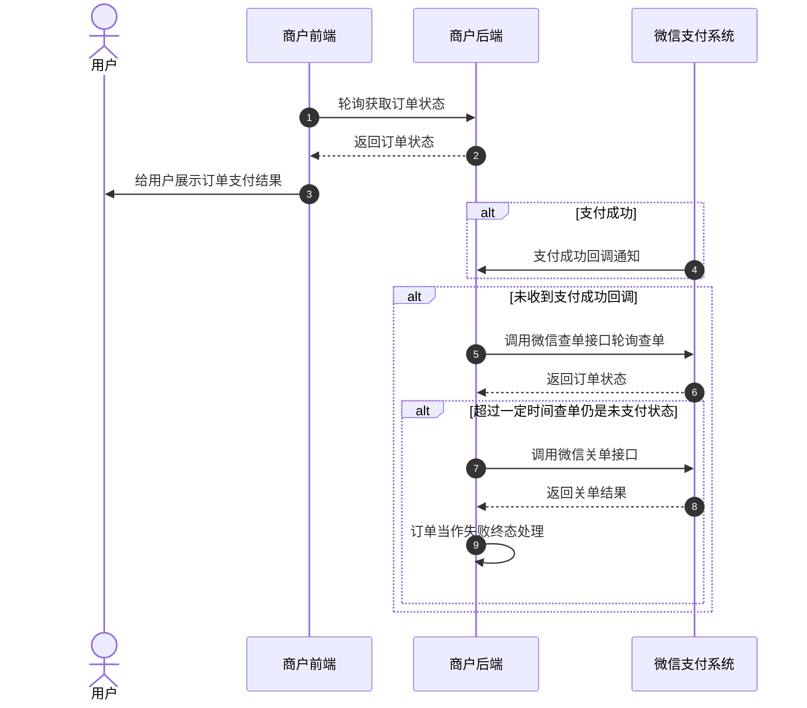
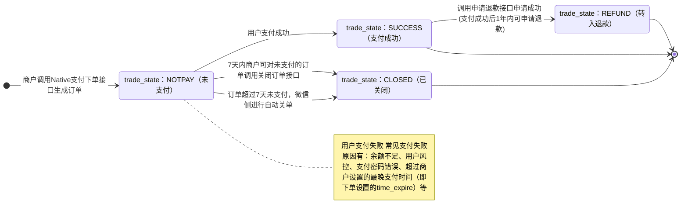

>更新时间：2026.06.09

## 1、整体业务开发流程概览

- 商户后端通过调用[Natvie支付下单](https://pay.weixin.qq.com/doc/v3/merchant/4012791877.md)接口获取二维码code（code\_url）后，然后由商户侧前端将二维码code转换为二维码图片展示给用户，用户微信扫描二维码拉起支付收银台。

- 当用户在收银台完成支付后点击完成按钮，微信支付会给商户后端发送[支付成功回调](https://pay.weixin.qq.com/doc/v3/merchant/4012791882.md)，如果商户后端未收到支付回调可以调用[查询订单API](https://pay.weixin.qq.com/doc/v3/merchant/4012791880.md)，并根据查询的订单状态进行相应的业务逻辑处理（在商户页面向用户展示查询到的订单支付状态、在商户内部系统更新订单状态等）。具体的支付回调和查单的实现方案，商户可以参考[支付回调和查单实现指引](https://pay.weixin.qq.com/doc/v3/merchant/4012075249.md)。

- 最后商户可通过[下载交易账单](https://pay.weixin.qq.com/doc/v3/merchant/4012791887.md)进行对账。需要退款的订单，也可调用[申请退款接口](https://pay.weixin.qq.com/doc/v3/merchant/4012791883.md)完成退款。

## 2、详细步骤说明

### 2.1、商户下单

商户通过调用[Native支付下单API](https://pay.weixin.qq.com/doc/v3/merchant/4012791877.md)接口生成订单并获取二维码 `code_url`，随后将该 `code_url` 传递至前端，由前端将其转换为二维码图片展示给用户。

下单接口关键参数说明：

`time_expire`：支付结束时间。若传递该参数，则用户只能在订单设置的支付结束时间 `time_expire` 之前进行支付，超过支付结束时间后，用户支付将收到："订单已超过商户设置的最晚支付成功时间，请重新发起支付"的提示，商户需对订单进行关单处理。若不传该参数，默认订单支付有效期为7天，用户可在7天内进行支付，超出7天，订单将被关闭。

`code_url`：二维码链接。此URL用于生成支付二维码，然后提供给用户扫码支付。 `code_url` 有效期为2小时，超过2小时，商户需要使用原下单参数重新请求下单接口，获取新的 `code_url`。

### 2.2、用户扫码调起支付

用户通过微信扫一扫，扫商户前端展示的支付二维码图片来调起微信收银台。具体请参考[Native调起支付](https://pay.weixin.qq.com/doc/v3/merchant/4012791878.md)

注意：

二维码不支持通过相册识别或长按识别二维码的方式完成支付

### 2.3、用户支付

用户在微信收银台完成支付/取消支付，商户后端则需要轮询调用[普通支付查询订单API](https://pay.weixin.qq.com/doc/v3/merchant/4012791880.md)接口获取订单状态，并根据订单状态向用户展示支付结果。

同时，如果用户支付成功，微信支付系统会向商户发送[支付成功回调](https://pay.weixin.qq.com/doc/v3/merchant/4012791882.md)。未收到回调时，商户也可调用[查询订单API](https://pay.weixin.qq.com/doc/v3/merchant/4012791880.md)接口确认订单状态。具体实现方案商户可以参考[支付回调和查单实现指引](https://pay.weixin.qq.com/doc/v3/merchant/4012075249.md)。

若商户需要限制用户支付的时间，有以下两种方式：

1、下单时通过 `time_expire` 参数，设置订单的支付结束时间，超过设置的结束时间后，商户进行关单处理。

2、商户在自己的系统内进行倒计时，超过有效期，进行关单处理。

若因特殊原因需在用户可支付时间范围内关闭订单，商户可通过调用[查询订单API](https://pay.weixin.qq.com/doc/v3/merchant/4012791880.md)接口确认订单状态，若订单仍是未支付状态，商户可以调用[关闭订单API](https://pay.weixin.qq.com/doc/v3/merchant/4012791881.md)接口关单，关单后可以将订单当作失败终态处理。

### 2.4、商户对账

详细参考：[账单产品介绍](https://pay.weixin.qq.com/doc/v3/merchant/4013071215.md)

### 2.5、订单退款

详细参考：[退款产品介绍](https://pay.weixin.qq.com/doc/v3/merchant/4013071001.md)

## 3、普通支付订单状态流转图

1、商户调用[Native支付下单](https://pay.weixin.qq.com/doc/v3/merchant/4012791877.md)接口下单成功后，商户可以调用[查询订单](https://pay.weixin.qq.com/doc/v3/merchant/4012791880.md)接口来确认订单状态，详情请参考[支付回调和查单实现指引](https://pay.weixin.qq.com/doc/v3/merchant/4012075249.md)。

2、当订单状态处于未支付(trade\_state：NOTPAY)时，用户可对订单进行支付，若用户支付失败，订单状态不变。

3、7天内商户可对无需继续支付的订单（例如用户超过商户系统内部规定的支付时间，或超过商户下单设置的最晚支付时间（time\_expire）的订单）调用[关单接口](https://pay.weixin.qq.com/doc/v3/merchant/4012791881.md)，使订单关闭，或超过7天后由微信侧自动关单。关单后，订单状态会从未支付(trade\_state：NOTPAY)流转为已关闭(trade\_state：CLOSED)。

4、当用户成功支付订单时，订单状态会从未支付(trade\_state：NOTPAY)流转为支付成功(trade\_state：SUCCESS)。

5、当订单状态为支付成功(trade\_state：SUCCESS)时，如果用户需要退款，商户可调用[申请退款接口](https://pay.weixin.qq.com/doc/v3/merchant/4012791883.md)(仅支持支付成功后1年内的订单)，退款申请成功后，订单状态会从支付成功(trade\_state：SUCCESS)流转为转入退款(trade\_state：REFUND)，退款状态可通过[查询退款单接口](https://pay.weixin.qq.com/doc/v3/merchant/4012791884.md)进行确认。

6、以下三个状态为终态

- trade\_state：CLOSED

- trade\_state：SUCCESS

- trade\_state：REFUND