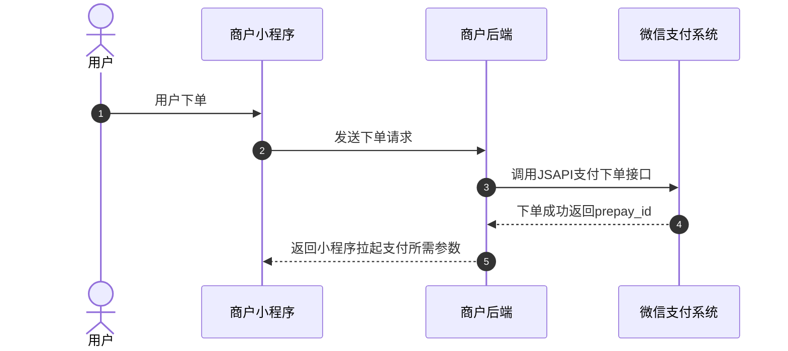
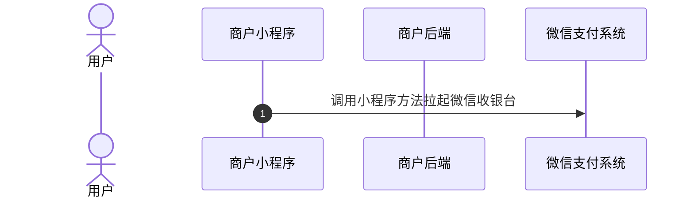
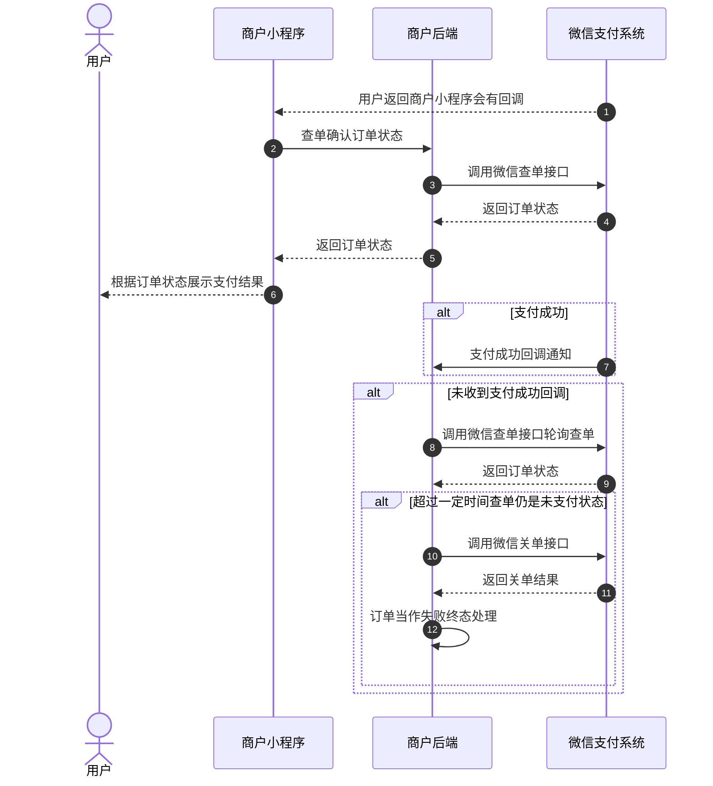
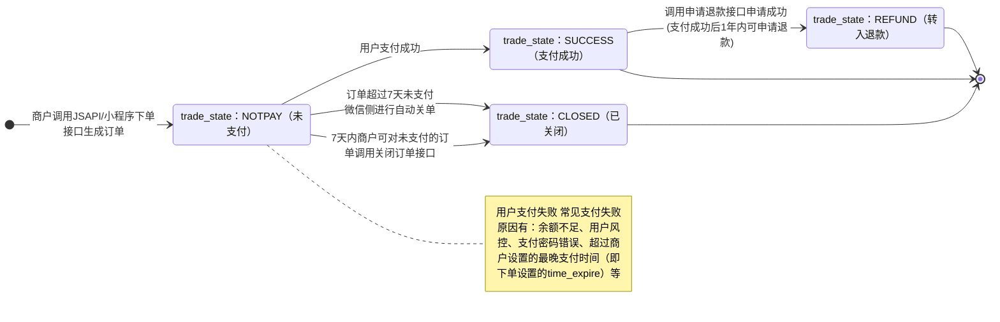

>更新时间：2026.06.09

## 1、整体业务开发流程概览

- 商户通过调用[JSAPI/小程序下单](https://pay.weixin.qq.com/doc/v3/merchant/4012791897.md)接口获取预支付交易会话标识(prepay\_id)，再通过小程序提供的[requestPayment](https://developers.weixin.qq.com/miniprogram/dev/api/payment/wx.requestPayment.html)方法，唤起微信支付收银台。

- 当用户在收银台完成支付后点击完成按钮，或中途取消支付，会返回拉起支付前小程序页面，同时商户小程序页面将收到小程序[requestPayment](https://developers.weixin.qq.com/miniprogram/dev/api/payment/wx.requestPayment.html)方法返回的回调，商户需调用[查询订单API](https://pay.weixin.qq.com/doc/v3/merchant/4012791900.md)接口确认订单状态，根据订单状态进行相应的业务逻辑处理（在商户页面向用户展示查询到的订单支付状态、在商户内部系统更新订单状态等）。如果订单支付成功，微信支付系统还会发送[支付成功回调通知](https://pay.weixin.qq.com/doc/v3/merchant/4012791902.md)给商户。具体的支付回调和查单的实现方案，商户可以参考[支付回调和查单实现指引](https://pay.weixin.qq.com/doc/v3/merchant/4012075249.md)。

- 最后商户可通过[下载交易账单](https://pay.weixin.qq.com/doc/v3/merchant/4012791907.md)进行对账。需要退款的订单，也可调用[退款接口](https://pay.weixin.qq.com/doc/v3/merchant/4012791903.md)完成退款。

## 2、详细步骤说明

### 2.1、商户下单

商户通过调用[JSAPI/小程序下单](https://pay.weixin.qq.com/doc/v3/merchant/4012791897.md)接口生成订单并获取预支付交易会话标识(prepay\_id)。

下单接口关键参数说明：

`time_expire`：支付结束时间。若传递该参数，则用户只能在订单设置的支付结束时间 `time_expire` 之前进行支付，超过支付结束时间后，用户支付将收到："订单已超过商户设置的最晚支付成功时间，请重新发起支付"的提示，商户需对订单进行关单处理。若不传该参数，默认订单支付有效期为7天，用户可在7天内进行支付，超出7天，订单将被关闭。

`prepay_id`：预支付交易会话标识。调起支付时需要使用的参数， `prepay_id` 有效期为2小时，超过2小时，商户需要使用原下单参数重新请求下单接口，获取新的 `prepay_id`。

注意

如果订单是通过前端按钮触发的下单，需要对按钮进行防抖处理，防止用户重复点击，避免产生重复支付，造成资金损失。

如下图所示：

| 图一 | 图二 |
| --- | --- |
|  |  |

### 2.2、商户调起支付

商户小程序通过调用小程序提供的[requestPayment](https://developers.weixin.qq.com/miniprogram/dev/api/payment/wx.requestPayment.html)方法来拉起微信收银台，详情参考[小程序调起支付](https://pay.weixin.qq.com/doc/v3/merchant/4012791898.md)

注意：若为交易类小程序，需要满足公众平台的[《交易类小程序运营规范》](https://developers.weixin.qq.com/miniprogram/product/jiaoyilei/yunyingguifan.html)，按照规范接入[订单发货管理功能](https://developers.weixin.qq.com/miniprogram/product/jiaoyilei/fahuoguanligongneng.html)，若不满足，可能被公众平台限制使用小程序进行支付的权限，无法在正式环境下调起小程序支付。

### 2.3、用户支付

用户在微信收银台完成支付/取消支付，返回商户小程序页面后，商户小程序页面将收到小程序提供的[requestPayment](https://developers.weixin.qq.com/miniprogram/dev/api/payment/wx.requestPayment.html)方法返回的回调，此时商户需要调[普通支付查询订单API](https://pay.weixin.qq.com/doc/v3/merchant/4012791900.md)接口确认订单状态，并根据订单状态展示支付结果。

同时，如果用户支付成功，微信支付系统会向商户发送[支付成功回调](https://pay.weixin.qq.com/doc/v3/merchant/4012791902.md)，未收到回调时，商户可调用[普通支付查询订单API](https://pay.weixin.qq.com/doc/v3/merchant/4012791900.md)接口确认订单状态。具体实现方案商户可以参考[支付回调和查单实现指引](https://pay.weixin.qq.com/doc/v3/merchant/4012075249.md)。

若商户需要限制用户支付的时间，有以下两种方式：

1、下单时通过 `time_expire` 参数，设置订单的支付结束时间，超过设置的结束时间后，商户进行关单处理。

2、商户在自己的系统内进行倒计时，超过有效期，进行关单处理。

若因特殊原因需在用户可支付时间范围内关闭订单，商户可通过调用[查询订单API](https://pay.weixin.qq.com/doc/v3/merchant/4012791900.md)接口确认订单状态，若订单仍是未支付状态，商户可以调用[关闭订单API](https://pay.weixin.qq.com/doc/v3/merchant/4012791901.md)接口关单，关单后可以将订单当作失败终态处理。

### 2.4、商户对账

详细参考：[账单产品介绍](https://pay.weixin.qq.com/doc/v3/merchant/4013071215.md)

### 2.5、订单退款

详细参考：[退款产品介绍](https://pay.weixin.qq.com/doc/v3/merchant/4013071001.md)

## 3、普通支付订单状态流转图

1、商户调用[JSAPI/小程序下单](https://pay.weixin.qq.com/doc/v3/merchant/4012791897.md)接口下单成功后，商户可以调用[查询订单](https://pay.weixin.qq.com/doc/v3/merchant/4012791900.md)接口来确认订单状态，详情请参考[支付回调和查单实现指引](https://pay.weixin.qq.com/doc/v3/merchant/4012075249.md)。

2、当订单状态处于未支付(trade\_state：NOTPAY)时，用户可对订单进行支付，若用户支付失败，订单状态不变。

3、7天内商户可对无需继续支付的订单（例如用户超过商户系统内部规定的支付时间，或超过商户下单设置的最晚支付时间（time\_expire）的订单）调用[关单接口](https://pay.weixin.qq.com/doc/v3/merchant/4012791901.md)，使订单关闭，或超过7天后由微信侧自动关单。关单后，订单状态会从未支付(trade\_state：NOTPAY)流转为已关闭(trade\_state：CLOSED)。

4、当用户成功支付订单时，订单状态会从未支付(trade\_state：NOTPAY)流转为支付成功(trade\_state：SUCCESS)。

5、当订单状态为支付成功(trade\_state：SUCCESS)时，如果用户需要退款，商户可调用[申请退款接口](https://pay.weixin.qq.com/doc/v3/merchant/4012791903.md)(仅支持支付成功后1年内的订单)，退款申请成功后，订单状态会从支付成功(trade\_state：SUCCESS)流转为转入退款(trade\_state：REFUND)，退款状态可通过[查询退款单接口](https://pay.weixin.qq.com/doc/v3/merchant/4012791904.md)进行确认。

6、以下三个状态为终态

- trade\_state：CLOSED

- trade\_state：SUCCESS

- trade\_state：REFUND