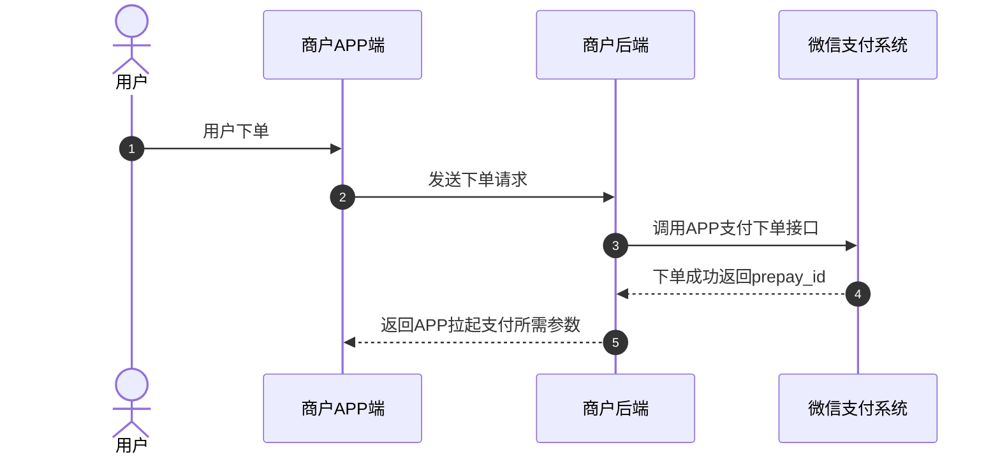
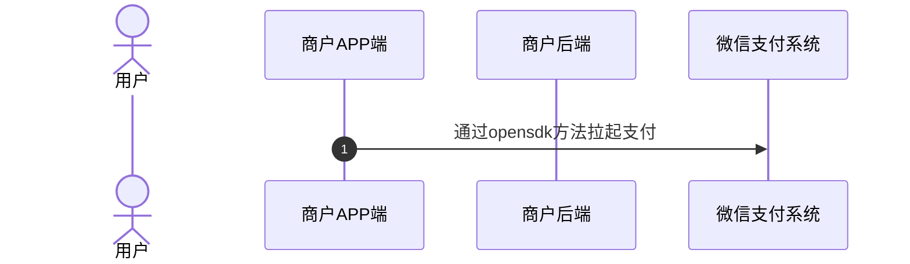
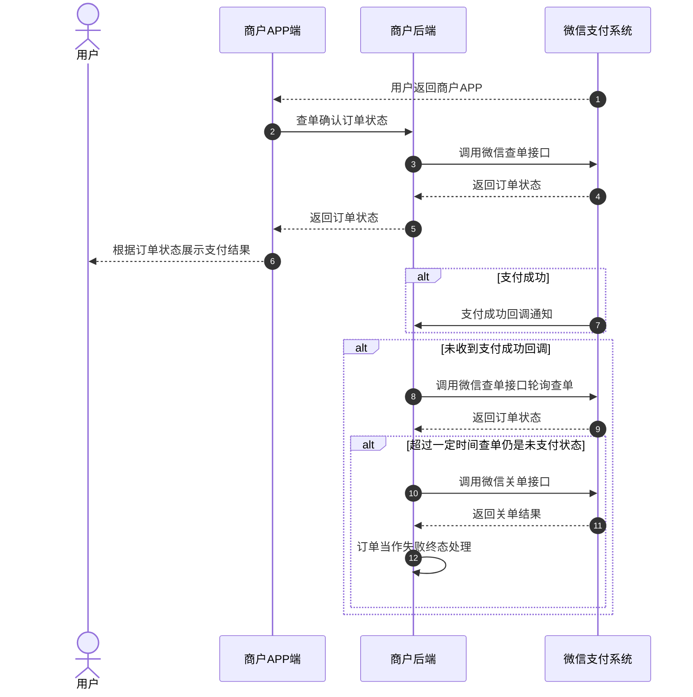
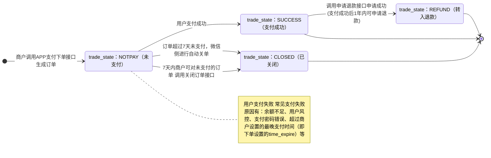

>更新时间：2026.06.09

## 1、整体业务开发流程概览

- 商户后端调用[APP支付下单](https://pay.weixin.qq.com/doc/v3/merchant/4013070347.md)接口获取预支付ID（prepay\_id）后，在商户APP中通过微信[OpenSDK](https://developers.weixin.qq.com/doc/oplatform/Mobile_App/Access_Guide/Android.html)提供的sendReq方法实现[APP调起支付](https://pay.weixin.qq.com/doc/v3/merchant/4013070351.md)，跳转到微信，并唤起微信支付收银台。

- 当用户在收银台完成支付后点击完成按钮，或中途取消支付，页面会从收银台跳转到商户APP内，同时商户APP前端将收到[OpenSDK](https://developers.weixin.qq.com/doc/oplatform/Mobile_App/Access_Guide/Android.html)发送的onResp回调，此时商户后端需调用[查询订单API](https://pay.weixin.qq.com/doc/v3/merchant/4013070354.md)接口确认订单状态，并根据订单状态进行相应的业务逻辑处理（在商户页面向用户展示查询到的订单支付状态、在商户内部系统更新订单状态等），如果订单支付成功，微信支付系统还会发送[支付成功回调通知](https://pay.weixin.qq.com/doc/v3/merchant/4013070368.md)给商户。具体的支付回调和查单的实现方案，商户可以参考[支付回调和查单实现指引](https://pay.weixin.qq.com/doc/v3/merchant/4012075249.md)。

- 最后商户可通过[下载交易账单](https://pay.weixin.qq.com/doc/v3/merchant/4013070395.md)进行对账。需要退款的订单，也可调用[退款接口](https://pay.weixin.qq.com/doc/v3/merchant/4013070371.md)完成退款。


## 2、详细步骤说明

### 2.1、商户下单

商户需要通过调用[APP支付下单API](https://pay.weixin.qq.com/doc/v3/merchant/4013070347.md)接口进行下单，并获取预支付ID（prepay\_id）。



下单接口关键参数说明：

`time_expire`：支付结束时间。若传递该参数，则用户只能在订单设置的支付结束时间 `time_expire` 之前进行支付，超过支付结束时间后，用户支付将收到："订单已超过商户设置的最晚支付成功时间，请重新发起支付"的提示，商户需对订单进行关单处理。若不传该参数，默认订单支付有效期为7天，用户可在7天内进行支付，超出7天，订单将被关闭。

`prepay_id`：预支付交易会话标识。调起支付时需要使用的参数， `prepay_id` 有效期为2小时，超过2小时，商户需要使用原下单参数重新请求下单接口，获取新的 `prepay_id`。

### 2.2、商户调起支付

商户调起支付前，需根据不同客户端系统接入对应的OpenSDK（推荐使用最新版本，具体请参考[OpenSDK接入指南](https://pay.weixin.qq.com/doc/v3/merchant/4013289321.md)），然后通过OpenSDK的sendReq方法调起微信支付页面，具体请参考[APP调起支付](https://pay.weixin.qq.com/doc/v3/merchant/4013070351.md)

注意：

- 开发微信支付接入Android系统的OpenSDK时，需要实现WXPayEntryActivity类，否则可能支付完成后，无法从微信内返回到商户APP，参考如下代码。

- Android13开始Intent过滤器会屏蔽不匹配的intent，存在无法返回商户APP的问题，解决方法：在manifest中，去除WXPayEntryActivity的intent-filter。

- 请严格遵循 OpenSDK 接入指引（《[安卓](https://developers.weixin.qq.com/doc/oplatform/Mobile_App/Access_Guide/Android.html)/[IOS](https://developers.weixin.qq.com/doc/oplatform/Mobile_App/Access_Guide/iOS.html)/[鸿蒙](https://developers.weixin.qq.com/doc/oplatform/Mobile_App/Access_Guide/ohos.html)接入指引》）接入SDK 以及配置开发环境。其中，IOS务必按指引 4.1 节（通过 CocoaPods 集成）配置“URL scheme”：若未配置，商户 APP 跳转微信小程序时可能出现 universal link 校验不通过的报错。


```
<activity
    android:name=".wxapi.WXPayEntryActivity"
    android:label="@string/app_name"
    android:theme="@android:style/Theme.Translucent.NoTitleBar"
    android:exported="true"
    android:taskAffinity="填写你的包名"
    android:launchMode="singleTask">
</activity>
```



### 2.3、用户支付

用户在微信收银台完成支付/取消支付，返回商户APP后，商户APP前端将收到opensdk发送的onResp回调，此时商户需要调[查询订单API](https://pay.weixin.qq.com/doc/v3/merchant/4013070356.md)接口确认订单状态，并根据订单状态向用户展示支付结果。

同时，如果用户支付成功，微信支付系统会向商户发送[支付成功回调](https://pay.weixin.qq.com/doc/v3/merchant/4013070368.md)。未收到回调时，商户也可调用[查询订单API](https://pay.weixin.qq.com/doc/v3/merchant/4013070356.md)接口确认订单状态。具体实现方案商户可以参考[支付回调和查单实现指引](https://pay.weixin.qq.com/doc/v3/merchant/4012075249.md)。

若商户需要限制用户支付的时间，有以下两种方式：

1、下单时通过 `time_expire` 参数，设置订单的支付结束时间，超过设置的结束时间后，商户进行关单处理。

2、商户在自己的系统内进行倒计时，超过有效期，进行关单处理。

若因特殊原因需在用户可支付时间范围内关闭订单，商户可通过调用[查询订单API](https://pay.weixin.qq.com/doc/v3/merchant/4013070356.md)接口确认订单状态，若订单仍是未支付状态，商户可以调用[关闭订单API](https://pay.weixin.qq.com/doc/v3/merchant/4013070360.md)接口关单，关单后可以将订单当作失败终态处理。



### 2.4、商户对账

详细参考：[账单产品介绍](https://pay.weixin.qq.com/doc/v3/merchant/4013071215.md)

### 2.5、订单退款

详细参考：[退款产品介绍](https://pay.weixin.qq.com/doc/v3/merchant/4013071001.md)

## 3、APP支付订单状态流转图



1、商户调用[APP支付下单](https://pay.weixin.qq.com/doc/v3/merchant/4013070347.md)接口下单成功后，商户可以调用[查询订单](https://pay.weixin.qq.com/doc/v3/merchant/4013070356.md)接口来确认订单状态，详情请参考[支付回调和查单实现指引](https://pay.weixin.qq.com/doc/v3/merchant/4012075249.md)。

2、当订单状态处于未支付(trade\_state：NOTPAY)时，用户可对订单进行支付，若用户支付失败，订单状态不变。

3、7天内商户可对无需继续支付的订单（例如用户超过商户系统内部规定的支付时间，或超过商户下单设置的最晚支付时间（time\_expire）的订单）调用[关单接口](https://pay.weixin.qq.com/doc/v3/merchant/4013070360.md)，使订单关闭，或超过7天后由微信侧自动关单。关单后，订单状态会从未支付(trade\_state：NOTPAY)流转为已关闭(trade\_state：CLOSED)。

4、当用户成功支付订单时，订单状态会从未支付(trade\_state：NOTPAY)流转为支付成功(trade\_state：SUCCESS)。

5、当订单状态为支付成功(trade\_state：SUCCESS)时，如果用户需要退款，商户可调用[申请退款接口](https://pay.weixin.qq.com/doc/v3/merchant/4013070371.md)(仅支持支付成功后1年内的订单)，退款申请成功后，订单状态会从支付成功(trade\_state：SUCCESS)流转为转入退款(trade\_state：REFUND)，退款状态可通过[查询退款单接口](https://pay.weixin.qq.com/doc/v3/merchant/4013070374.md)进行确认。

6、以下三个状态为终态

- trade\_state：CLOSED

- trade\_state：SUCCESS

- trade\_state：REFUND