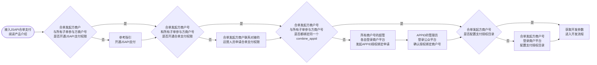

>更新时间：2026.09.18

流程说明

1、阅读[产品介绍文档](https://pay.weixin.qq.com/doc/v3/merchant/4012077221.md)，了解JSAPI合单支付产品特性；

2、合单发起方商户与所有子单参与方商户参考[JSAPI支付-开发接入准备-步骤1~6](https://pay.weixin.qq.com/doc/v3/merchant/4015423216.md)的指引开通JSAPI支付权限；

3、合单发起方商户联系对接的运营人员申请合单支付权限（为合单发起方商户号申请发起合单权限，为所有子单参与方商户号申请接收合单权限）；

4、合单发起方商户号与所有子单参与方商户号的超级管理员，都需要各自登录[商户平台](https://pay.weixin.qq.com/)，[发起与APPID授权绑定](https://pay.weixin.qq.com/doc/v3/merchant/4013426141.md#2.2%E3%80%81%E7%99%BB%E5%BD%95%E5%95%86%E6%88%B7%E5%B9%B3%E5%8F%B0%E5%8F%91%E8%B5%B7APPID%E7%9A%84%E6%8E%88%E6%9D%83%E7%BB%91%E5%AE%9A%E7%94%B3%E8%AF%B7)申请，且所有商户号需要绑定同一个APPID；支持绑定的APPID类型：服务号、政府或媒体类型的公众号；

5、APPID的管理员登录[公众平台](https://mp.weixin.qq.com/)，完成步骤4中合单发起方商户号和所有合单子单参与方商户号的[授权绑定确认](https://pay.weixin.qq.com/doc/v3/merchant/4013426141.md#2.3%E3%80%81%E7%99%BB%E5%BD%95%E5%AF%B9%E5%BA%94%E5%B9%B3%E5%8F%B0%E7%A1%AE%E8%AE%A4%E6%8E%88%E6%9D%83%E7%BB%91%E5%AE%9A%E7%9A%84%E5%95%86%E6%88%B7%E5%8F%B7)；

6、合单发起方商户号的超级管理员登录[商户平台](https://pay.weixin.qq.com/)，[配置JSAPI支付授权目录](https://pay.weixin.qq.com/doc/v3/merchant/4013287088.md)，配置的内容请和技术负责人确认；

7、获取[开发参数](https://pay.weixin.qq.com/doc/v3/merchant/4013070756.md)，进入[开发流程](https://pay.weixin.qq.com/doc/v3/merchant/4012078634.md)。