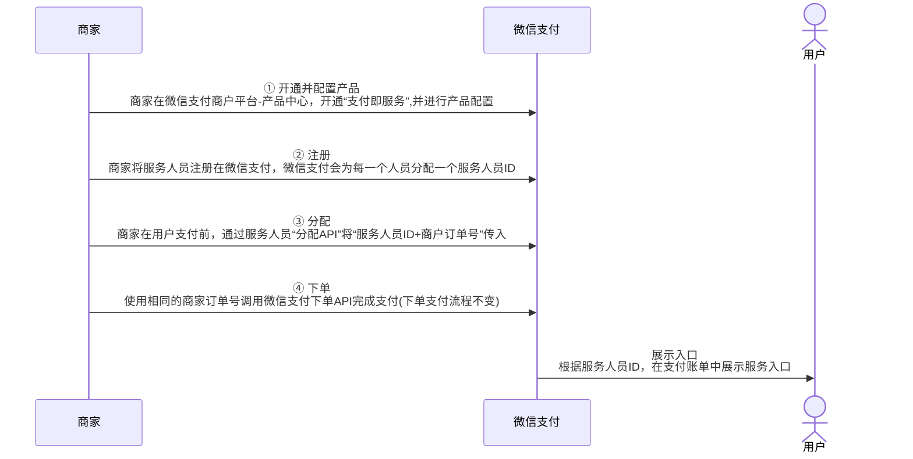

>更新时间：2026.06.10

## 简介

服务人员，是商家为用户提供服务和转化生意的重要一环。通过支付即服务，商家可在支付完成后为用户推送专属服务人员名片，方便用户快速添加专属服务人员为好友，将线下短时服务转化为线上持续服务，弱联系变为强连接，提升用户体验和商家运营效率。

## 产品特点

- 微信支付账单页带服务人员名片

协助商家沉淀优质用户，为商家的服务带来持续、稳定的曝光，提供二次连接用户的机会。

- 服务人员信息展示

服务人员名片展示服务人员姓名、头像、门店等信息，并提供为服务人员点赞等互动功能，增强用户专属感的同时提升亲密度，利于双方发生二次联系。

- 快速好友添加

服务人员名片会直接展示服务人员二维码（企业微信或个人微信），方便用户快速添加专属服务人员为好友，将线下短时服务转化为线上持续服务，弱联系变为强连接，创造未来触达的可能性。

- 跨时空连接

支付即服务推送的服务人员名片可随时通过支付账单找回。即使用户在支付完成的当下未添加服务人员，只要后续产生了对商家服务的需求，可随时进入服务人员名片页面进行添加。支付即服务跨时空的连接方式满足了用户的延时需求，进一步提高商家连接用户的效率。

## 产品示例

用户在商家支付完成后，可在微信支付账单页点击“联系商家xxx”（如点击左图中的联系商家服务人员），进入商家的服务人员名片，扫描二维码快速添加服务人员为好友。

## 产品优势

- 优势一：1 vs. N vs. N的框架模型

1 ：N：N的模式，一个商户号可以对应着若干个门店，而一个门店下又对应着若干个服务人员。这种以细化到人的维度去触达用户的模式提高了商家与用户进行联系的效率，能较快地辐射到更多用户，且能给单个用户更具个性化的服务和营销。

- 优势二：企业微信、个人微信全方位支持

为了满足各行各业商家的服务人员在线下的真实服务现状，支付即服务产品对企业微信和个人微信进行了全方位的支持。

- 优势三：灵活分配服务人员

支付即服务在不改变商家原有下单支付流程的基础上，支持商家为用户灵活分配服务人员。服务人员的分配规则完全在商家内部闭环，满足不同商家的差异化需求。

## 操作指引

支付即服务的接入流程如图所示：

1. 商家开通支付即服务，并进行产品相关设置，产品相关配置流程参见《[开发接入准备](https://pay.weixin.qq.com/doc/v3/partner/4012076037.md)》；

2. 注册服务人员，由微信支付为每一位注册成功的服务人员生成一个服务人员ID；

3. 商家在下单前进行服务人员分配，为指定的订单传入对应的服务人员ID；

4. 该笔订单正常完成支付流程，用户即可在支付后的账单页点击查看服务人员名片。

提示

普通服务商模式下，需普通服务商、特约商户分别开通产品，并由普通服务商邀请特约商户授权产品权限。完成授权后，特约商户需自行进行产品设置，完成设置后方可由普通服务商调用接口进行后续的注册、分配等流程。