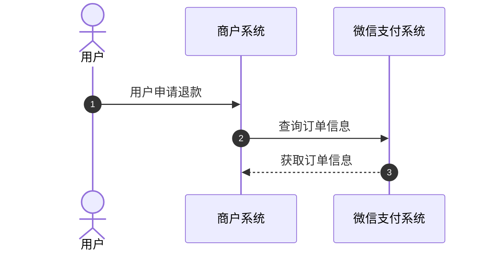
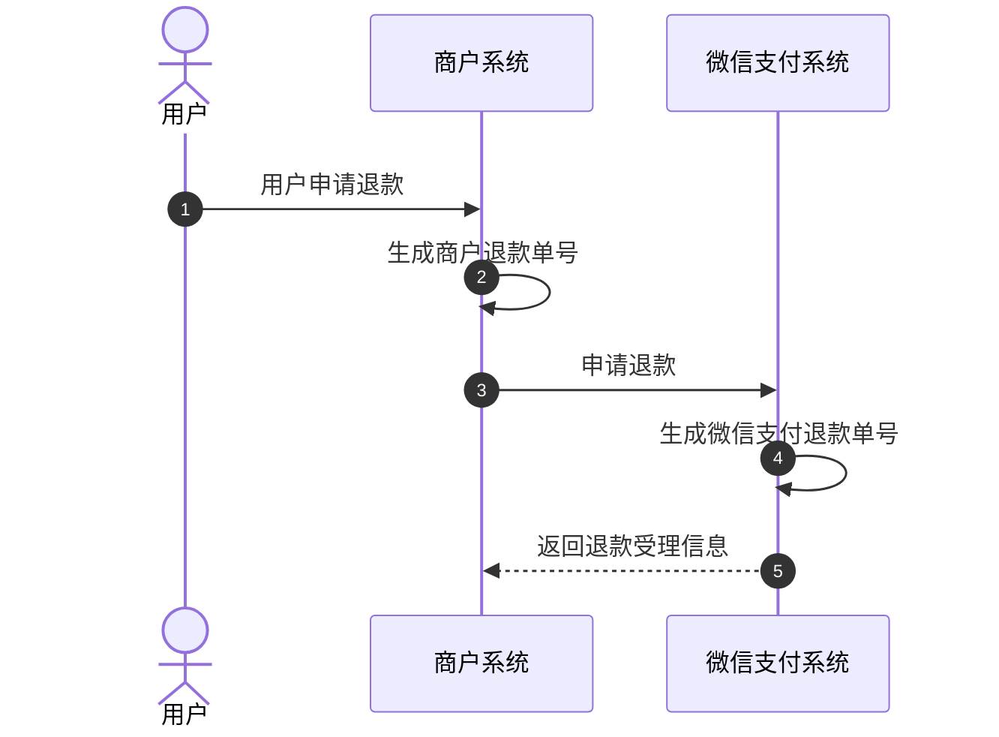
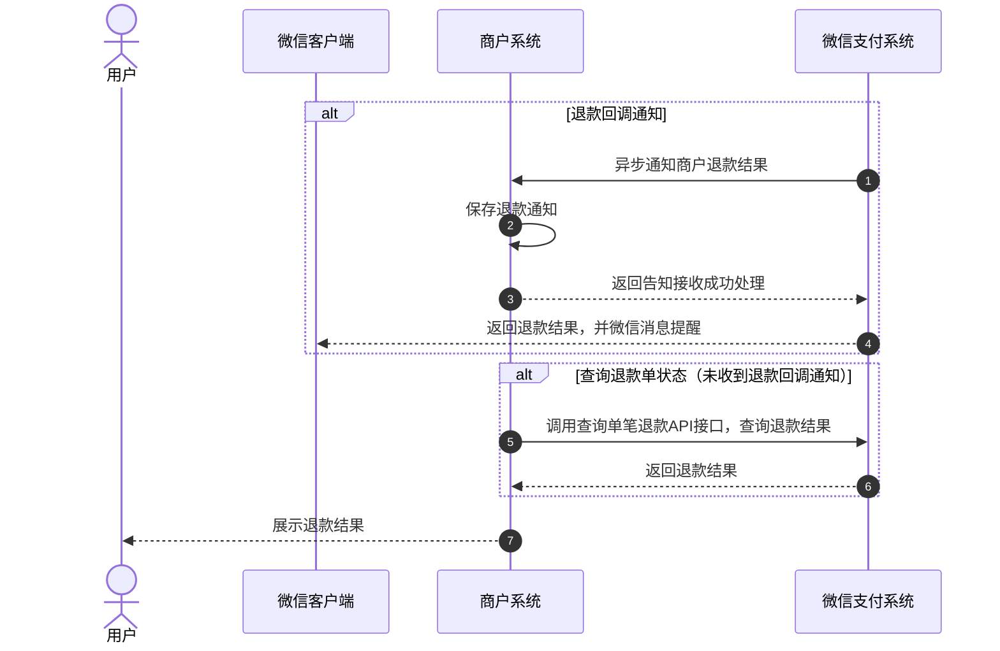
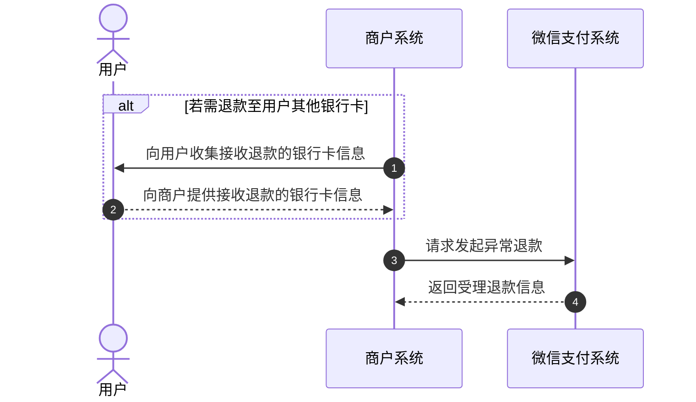
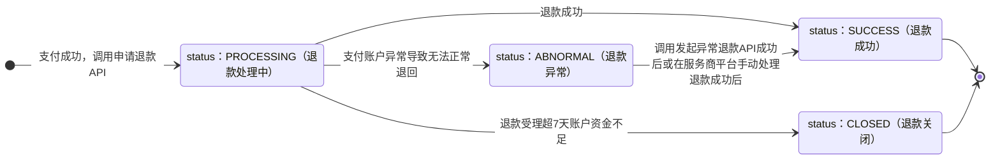

>更新时间：2026.06.10

## 1、整体业务开发流程概览

若存在退款需求，服务商需先调用[查询订单状态](https://pay.weixin.qq.com/doc/v3/partner/4013080235.md)接口以确认订单支付状态为已支付成功，随后调用[申请退款API](https://pay.weixin.qq.com/doc/v3/partner/4013080625.md)创建退款单后，可通过[查询单笔退款信息](https://pay.weixin.qq.com/doc/v3/partner/4013080626.md)或[退款回调通知](https://pay.weixin.qq.com/doc/v3/partner/4013080628.md)以确认最终的退款结果。若退款状态为退款异常，则需调用[发起异常退款API](https://pay.weixin.qq.com/doc/v3/partner/4013080627.md)进行退款操作。

## 2、详细步骤说明

### 2.1、查询订单状态

服务商在退款之前调用[微信支付订单号查询订单API](https://pay.weixin.qq.com/doc/v3/partner/4013080234.md)或[商户订单号查询订单API](https://pay.weixin.qq.com/doc/v3/partner/4013080235.md)，确认订单支付状态，支付成功才可进行退款。

### 2.2、申请退款

服务商调用[申请退款API](https://pay.weixin.qq.com/doc/v3/partner/4013080625.md)创建退款单，退款单受理成功后，微信会从交易收款商户（子商户，也叫特约商户）的基本账户内扣除需退款的资金，退款资金会进入到微信侧退款的中间账户，然后再退回给用户。

注意：

- 对于合单支付的订单，无法通过合单支付总单号 `combine_out_trade_no` 退款，只能根据单个子单进行退款。

- 若支付订单为分账订单，存在分账给其他商户号成功情况，退款不会自动回退分账金额，退款出资为子商户基本账户可用余额。

申请退款接口需要注意的参数：

普通支付订单退款或合单支付订单退款时，需选择填写 `transaction_id` 或 `out_trade_no` 中的一个，普通支付订单退款按照API接口参数填写；合单支付订单退款需要特别注意以下参数字段：

`transaction_id`：填写原合单支付订单的 `sub_orders.transaction_id`【子单微信支付订单号】

`out_trade_no`：填写原合单支付订单的 `sub_orders.out_trade_no`【子单商户订单号】

### 2.3、确认退款结果

退款处理完成后，微信支付会将[退款结果通知](https://pay.weixin.qq.com/doc/v3/partner/4013080628.md)发送到[申请退款](https://pay.weixin.qq.com/doc/v3/partner/4013080625.md)时传递的【notify\_url】地址，通知内容需要使用APIV3密钥进行加密解密，所以需要提前设置APIV3密钥，设置指引：[APIv3密钥设置方法](https://pay.weixin.qq.com/doc/v3/partner/4013059095.md)。

若未收到退款回调通知或服务商希望主动获取退款状态时，可调用 [查询单笔退款（按商户退款单号）](https://pay.weixin.qq.com/doc/v3/partner/4013080626.md)查询退款单信息，推荐申请退款后间隔1分钟调用该接口轮询一次退款状态，若超过5分钟仍是退款处理中状态，建议开始逐步衰减轮询频率(比如之后间隔5分钟、10分钟、20分钟、30分钟……轮询一次)。

退款状态：

SUCCESS—退款成功

CLOSED—退款关闭：此状态表明您的退款请求已经关闭。原因是退款单已经处于“退款处理中”的状态超过7天，并且在这段时间内，出资账户的余额不足以完成退款操作。可充值后生成新的商户退款单号，重新调用[退款申请API](https://pay.weixin.qq.com/doc/v3/partner/4013080625.md)。

PROCESSING—退款处理中：可稍后再次调用[查询单笔退款（按商户退款单号）](https://pay.weixin.qq.com/doc/v3/partner/4013080626.md)，确认最终退款结果。

ABNORMAL—退款异常：退款到银行发现用户的卡作废或者冻结了，导致原路退款银行卡失败，可前往[服务商平台](https://pay.weixin.qq.com/index.php/partner/public/home)-交易中心，手动处理此笔退款。或调用[发起异常退款API](https://pay.weixin.qq.com/doc/v3/partner/4013080627.md)接口处理异常退款。

注意：

退款有一定延时，零钱支付的订单退款一般5分钟内到账，银行卡支付的订单退款一般1-3个工作日到账，具体以[查询退款](https://pay.weixin.qq.com/doc/v3/partner/4013080626.md)接口返回状态为准。

### 2.4、发起异常退款

提交退款申请后，若查询退款确认状态为退款异常，退款资金会停留在退款的中间账户内，服务商可调用[发起异常退款API](https://pay.weixin.qq.com/doc/v3/partner/4013080627.md)接口发起异常退款，使退款资金从退款中间账户退到用户的银行卡，或退回交易收款商户（子商户）基本账户的结算银行账户。

注意：

退款至用户时，仅支持以下银行的借记卡：招行、交通银行、农行、建行、工商、中行、平安、浦发、中信、光大、民生、兴业、广发、邮储、宁波银行。

发起异常退款关键参数：

`type`：可选择退款到用户银行卡，或退回到交易收款商户（子商户）银行账户内。

若选择退款给用户银行卡，需在对收款银行卡号 `bank_account` 和收款用户姓名 `real_name` 进行[敏感信息加密](https://pay.weixin.qq.com/doc/v3/partner/4013059044.md)。

## 3、退款单状态流转图

退款单状态流转说明

1、服务商调用[退款申请](https://pay.weixin.qq.com/doc/v3/partner/4013080625.md)接口受理成功后，可以调用[查询单笔退款（按商户退款单号）](https://pay.weixin.qq.com/doc/v3/partner/4013080626.md)接口来确认退款单状态。

2、当退款单状态为退款处理中(status：PROCESSING)时，退款受理超过7天且账户资金不足时，退款单状态将流转为退款关闭(status：CLOSED)。

3、当退款单状态为退款处理中(status：PROCESSING)时，若因用户账户异常（例如银行卡作废或冻结）导致资金无法按原路退回，微信支付会优先尝试将退款金额转入用户的微信零钱。仅当用户的微信零钱账户也已注销时，退款单状态才会流转为退款异常(status：ABNORMAL)。

4、当退款成功时，退款单状态将从退款处理中(status：PROCESSING)流转为退款成功(status：SUCCESS)。

5、当退款单状态为退款异常(status：ABNORMAL)时，此时服务商可以到【[服务商平台](https://pay.weixin.qq.com/index.php/partner/public/home) —>交易中心】[手动处理退款](https://kf.qq.com/faq/140225MveaUz150107mAVz6F.html)或调用[发起异常退款](https://pay.weixin.qq.com/doc/v3/partner/4013080627.md)接口处理异常退款，当退款成功后，退款单状态将流转为退款成功(status：SUCCESS)。

6、以下两个状态为终态

- status：SUCCESS

- status：CLOSED