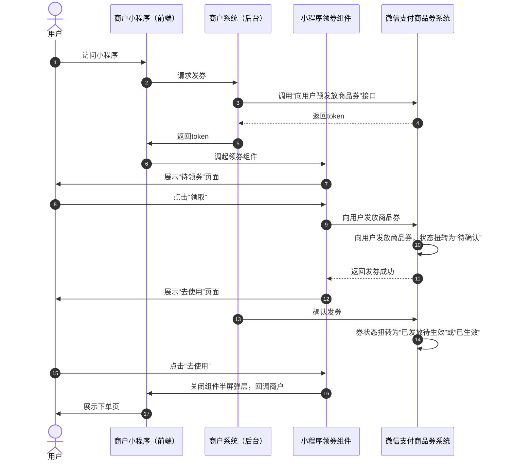

>更新时间：2026.06.10

## 1、开发前准备

A、商家需先访问[微信支付品牌经营平台](https://pay.weixin.qq.com/xdc/brandhomeweb/brand/home#/)开通品牌，成为微信支付品牌商家。详细流程可见：[【商户版】品牌经营平台介绍](https://doc.weixin.qq.com/doc/w3_AUMA3AbsAKcCNqNE3jV15S96SGeWR?scode=AJEAIQdfAAockxrOtDAcoAmgbgAOI)

1. 完成“商品券”创建。商品券是微信支付品牌商家营销券体系，详细介绍可见：[创建商品券](https://pay.weixin.qq.com/doc/v3/partner/4015781289.md)

2. （仅限灰度期间）提供需要接入的品牌id给微信支付运营同事，添加调用权限

3. 按照文档接入，并且验收上线

## 2、整体业务开发流程概览

步骤说明

1. 发券：商户后端调用“[向用户预发放商品券](https://pay.weixin.qq.com/doc/v3/partner/4016434365.md)”接口获取token后，在微信客户端前端页面调起“[调起小程序发券组件](https://pay.weixin.qq.com/doc/v3/partner/4016434346.md)”展示“待领取”页面。用户点击“立即领取”完成领券

2. 确认发券：用户领券后，微信支付会向商户发送“[商品券回调通知](https://pay.weixin.qq.com/doc/v3/partner/4015780862.md)”，商户接受通知后需调用“[确认发放用户商品券](https://pay.weixin.qq.com/doc/v3/partner/4015781575.md)”接口，确认发券成功。此时微信支付会将券状态从“待确认”扭转至“待生效”或“已生效”（取决于券可用时间）

3. 用券：用户领券后，组件会展示“去使用”页面，用户点击“去使用”按钮（当有单品可选择时，按钮为“去使用”），组件会回调返回单品跳转路径，由商户小程序自行完成跳转，引导用户进入下单页