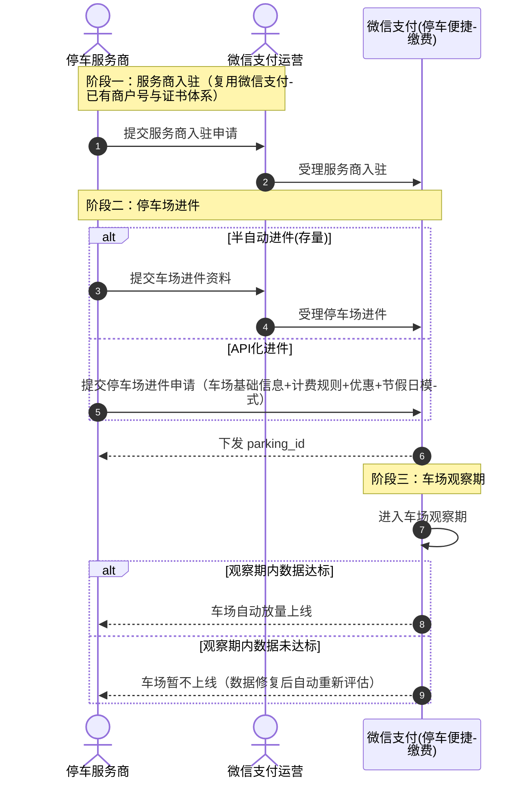
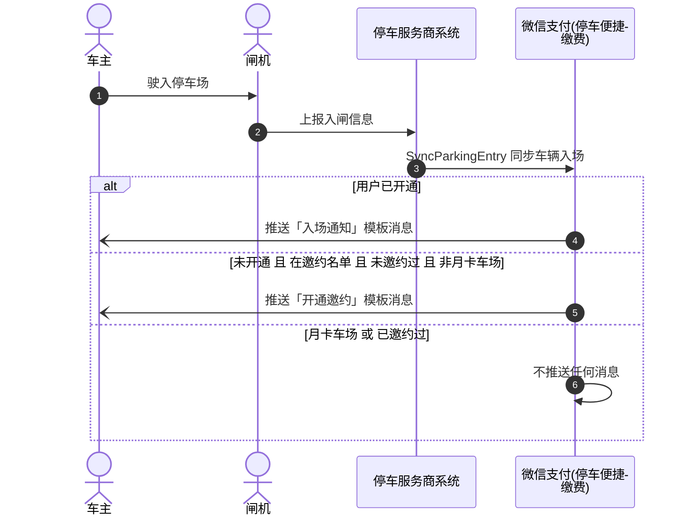
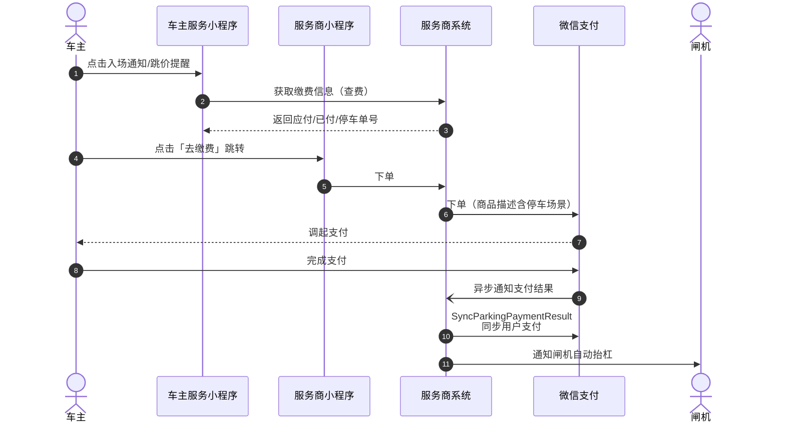
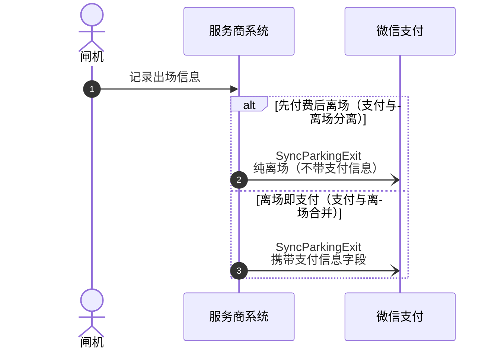
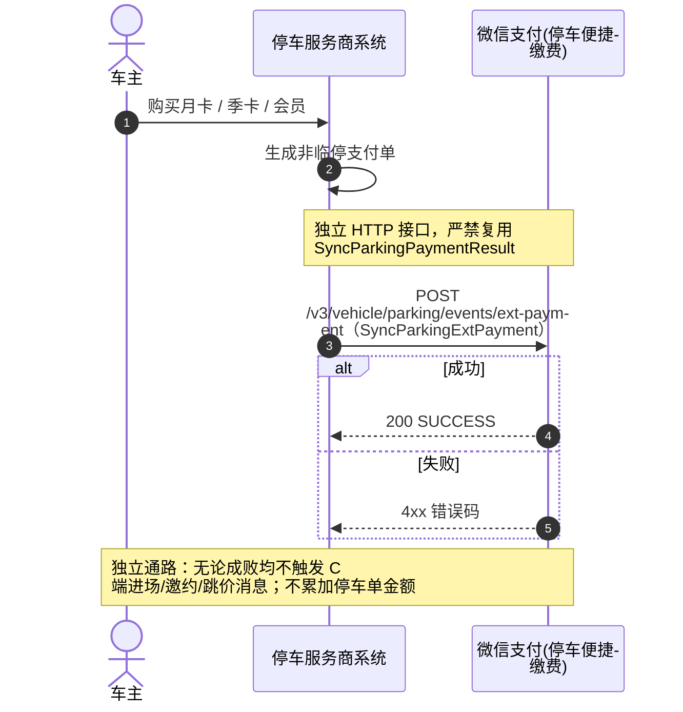

>更新时间：2026.06.30

## 1、接入准备

### 1.1 接入模式

停车便捷缴费仅支持服务商模式接入，服务商需完成如下前置准备：

| 准备项 | 说明 | 获取路径 |
| --- | --- | --- |
| 服务商 mchid | 服务商在微信支付申请入驻的账号 | [服务商平台](https://pay.weixin.qq.com/partner/public/home) |
| AppID | 服务商小程序 AppID（承接缴费收款页） | [微信公众平台](https://mp.weixin.qq.com/) |
| API v3 密钥 | 用于敏感字段加解密 | 服务商平台自行设置 |
| 商户 API 证书 | 用于请求签名与验签 | 服务商平台下载 |
| 微信支付平台证书 / 公钥 | 用于回包与回调验签 | API 下载 |

### 1.2 签名与验签

沿用微信支付 APIv3 通用签名方案，详见：

- [APIV3接口签名和验签说明文档](https://pay.weixin.qq.com/doc/v3/partner/4012365870.md)

- [如何使用签名/验签工具](https://pay.weixin.qq.com/doc/v3/partner/4012365880.md)

同步车辆入场通知、同步车辆离场通知、同步支付结果通知、同步非临停扩展支付接口统一使用 HTTP POST + JSON \+ `WECHATPAY2-SHA256-RSA2048` Authorization 头格式。

### 1.3 入驻流程

1、服务商入驻：与微信支付运营人员完成服务商主体入驻对接

2、停车场进件：

- 方式一：通过进件 API 自助提交

- 方式二：与微信支付运营人员对接

3、运营受理：运营侧审核通过后，车场进入观察期

4、车场数据观察：对车场运营数据进行跟踪评估

5、结果判定：

- 达标：车场自动放量，正常接入使用，达到启用状态

- 不达标：车场自动临时下线，需优化后重新评估

## 2、全流程序列图

### 2.1 入驻阶段

### 2.2 车辆进场（通知/邀约）

### 2.3 缴费阶段

### 2.4 车辆离场

### 2.5 非临停支付（独立通路）

## 3、注意事项

接入方必须严格遵守以下注意事项，违反可能会导致数据不达标，车场下线返佣不结算情况：

| 序号 | 开发注意事项 | 影响 |
| --- | --- | --- |
| 1 | 车辆入场、车辆出场、同步支付结果接口为微信支付感知车辆状态的唯一来源，三者缺一不可，若缺少可能导致状态错乱 | 车辆状态错乱，邀约缴费关单异常 |
| 2 | 同一支付信息仅可在「[同步车辆离场](https://pay.weixin.qq.com/doc/v3/partner/4019557725.md)」接口、「[同步支付结果](https://pay.weixin.qq.com/doc/v3/partner/4019557765.md)」接口中二选一上报，不得同时上报 | 支付消息重复上报，导致订单金额错乱、对账异常 |
| 3 | 非临停场景（月卡/季卡/会员等固定缴费模式）使用独立的[非临停支付](https://pay.weixin.qq.com/doc/v3/partner/4020338487.md)接口，不能写入临停支付接口 | 污染临停语义 / 误触发邀约 |
| 4 | 车场闸机抬杆放行逻辑由接入方服务商自行控制，微信侧不直接控闸机 | 放行逻辑不可混淆 |